# 基于有监督机器学习的声源定位:
## 和传统匹配场处理的比较兼混合训练尝试
## 一 、基于机器学习的定位方法
### 输入数据预处理：
>输入采样协方差矩阵

- 声压：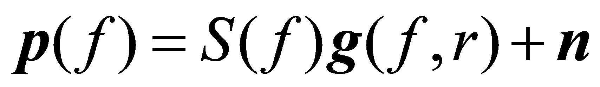

	其中， ***n*** 是噪声，***S(f)*** 是声源信号， 
    ***g(f,r)*** 是格林函数，接收阵有 ***L*** 个传感器

- 归一化：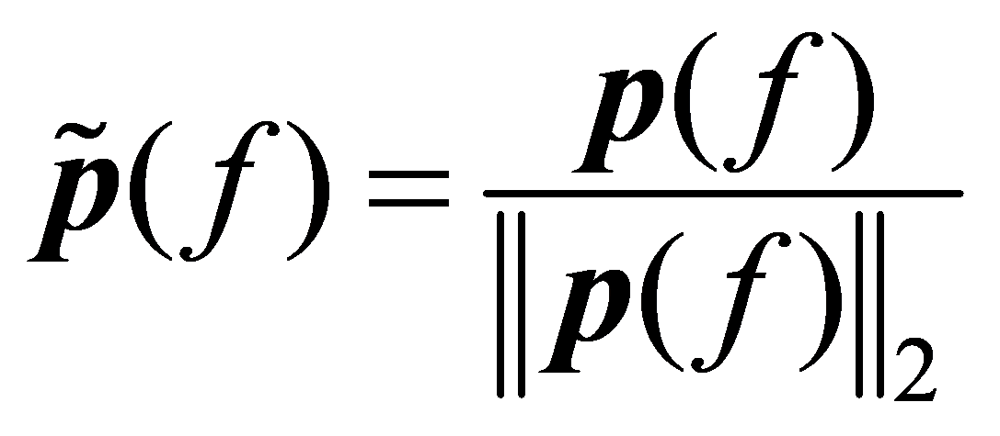
    
    复声压归一化，取**Ns**个快拍的均值得采样协方差矩阵

- 采样协方差矩阵：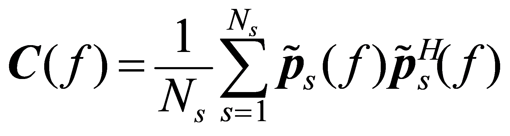

	最后，取采样协方差矩阵上三角每个元素的实部和虚部，组成 
    ***D=L(L+1)*** 维的列向量 **x** 作为前馈神经网络的输入。

### 声源位置映射：
>声源定位当作分类问题

将要搜索的Range划分成K个网格，一个声源水平位置对应一个标记向量**t n**，每一个向量只有一个元素是1，对应声源位置

    
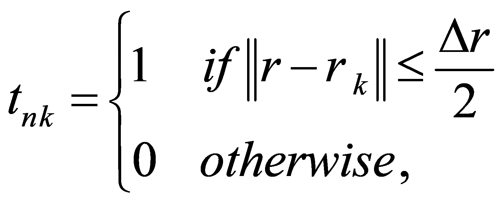

其中，n=1,...,N是输入样本的序号,rk(k=1,...,K)是预先标记的水平位置，因此每一个输入样本的标记向量tn都对应一个水平位置rk。

    
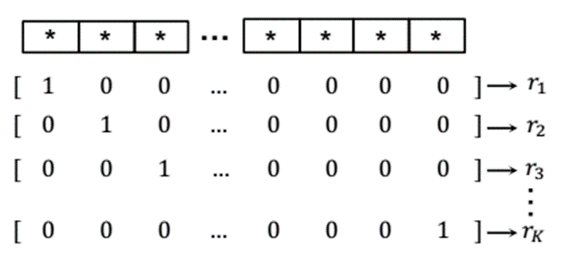

 图1 声源定位当作分类问题 

### 前馈神经网络:
>网络由输入、输出和一个隐含层构成，分别包含D，M，K个神经元

>神经网络的输出对应了声源水平位置的概率估计

前馈神经网络(FNN)，也称[多层感知机](https://zh.wikipedia.org/wiki/%E4%BA%BA%E5%B7%A5%E7%A5%9E%E7%BB%8F%E7%BD%91%E7%BB%9C)(MLP)，如图2，是一种前向结构的人工神经网络，映射一组输入向量到一组输出向量。MLP可以被看作是一个有向图，由多个的节点层所组成，每一层都全连接到下一层。除了输入节点，每个节点都是一个带有非线性激活函数的神经元（或称处理单元）。一种被称为反向传播算法的监督学习方法常被用来训练MLP。MLP是感知器的推广，克服了感知器不能对线性不可分数据进行识别的弱点。

 
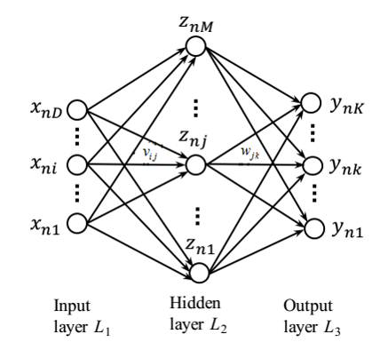
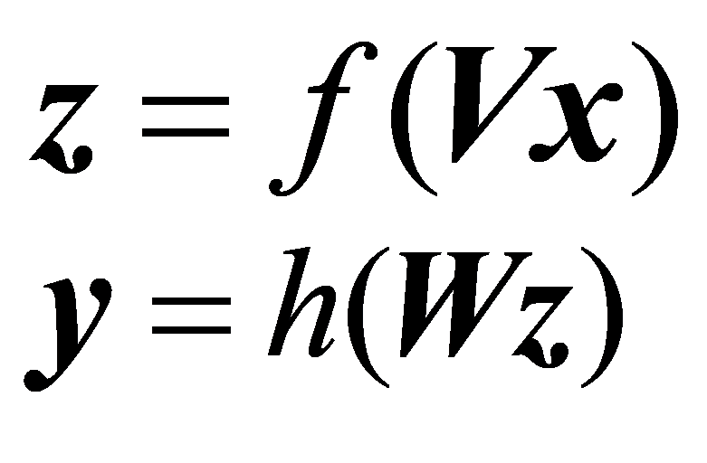

  

 图 2 前馈神经网络 

图2给出的是一个三层的网络模型（输入层*L*1,隐藏层*L*2和输出层*L*3），输入层*L*1由**D**个输入变量**x**=[x1,...,xD]组成。

输入变量的第 *j* 个线性组合是 

 
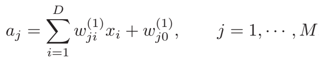

 

其中，*M*是*L*2层神经元的个数，下标 *i* , *j* 分别和*L*1，*L*2 层的神经元对应。系数 *v**j,i* 和*v**j,0*称为权值和偏置，它们的线性组合 *a**j* 称为预激活因子。在 *L*2 层中，*a**j*经过一个非线性激活函数 *f(.)* 激活得到 *z**j*，

 
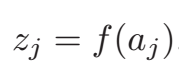

 

这里选取的激活函数是*Sigmoid*函数，它将输入自变量转换到区间(0,1)，其图像如图3,

 
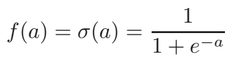

 

在 *L*3 输出层，预激活因子 *a**k* 表示为 *a**j* 的线性组合，

 
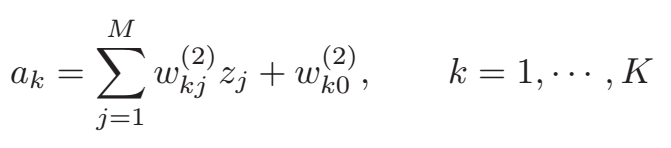

 

同样，系数 *w**k,j* 和*w**k,0*是该层的权值和偏置，输出层使用*Softmax*函数作为激活函数，*Softmax*函数是多标签分类问题的常用函数，因此可得输出层 *y**k*(**x**,**w**), 对应声源在 *r**k* 位置的概率

 
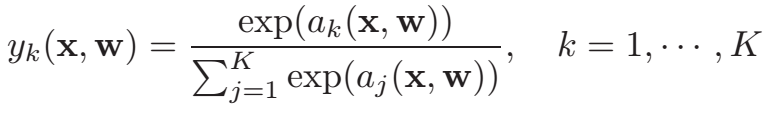

 

**w** 是权值和偏置的集合，*y**k* 取值0~1，并且加和为1。

 
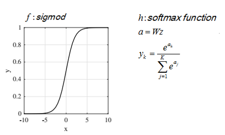

  

 图 3  ***Sigmoid,Softmax*** 函数 

使用FNN对无标签数据进行分类之前，需要先使用有标签数据对网络进行训练，学习出网络的权重系数。在训练的过程中，使用*Kullback-Leibler(KL)*散度度量输出概率分布 **y**(**x**n,**w**) 和真实分布 **t**n 之间的距离，

 
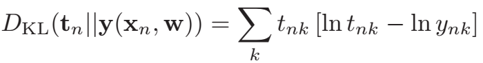

 

因为 *t**nk* 是定值，所以最小化 *KL* 散度等价于最小化交叉熵 *E*n

 
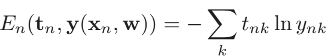

 

对 *N* 观察向量，容易写出交叉熵函数为

 
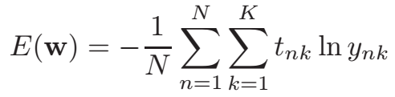

 

最后，神经网络训练的目标函数为

 
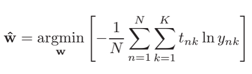

  

## 二、仿真和实验结果
>Matlab处理数据+Tensorflow训练神经网络

在这一小节，我们分别在仿真数据和实验数据上对FNN分类器进行了训练及测试，
比较了单频和多频时分类器性能，并与传统匹配场处理方法(Bartlett)进行了比较,最后仿真试验了声速剖面失配对FNN分类器的影响，
尝试用不同ssp下的采集数据混合训练来提高分类器的泛化能力。

仿真环境是被大家广泛研究的
[SWell96Ex](http://swellex96.ucsd.edu/environment.htm)试验,该水声试验由美国海洋物理实验室(Marine Physical Lab)等单位在1996年5月10日至18日于圣迭戈市附近海域进行，试验环境是一个216m深的浅海波导环境。试验中水面船船速是2.5m/s，垂直阵的摆放深度以及详细的环境参数如图4。

    
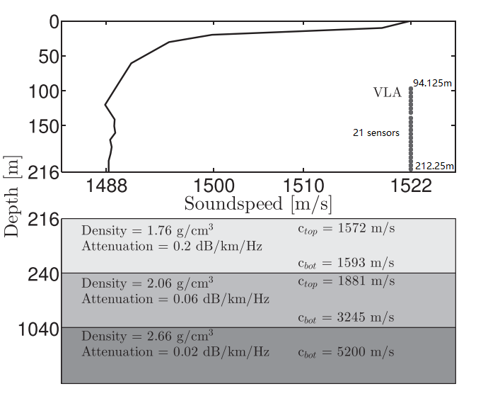

 图4 仿真环境示意图 

此次海试发射船共拖有两个声源，其中一个声源为“深”声源(J-15)，拖曳深度大约为54 m，发射由13个频率组成带宽为0~400 Hz的宽带CW信号；另一个声源为浅声源(J-13)，拖曳深度大约为9m，发射由9个频率组成带宽为100~400Hz的宽带CW信号，在所有的仿真中，我们使用的是浅声源(J-13)。

### 仿真设置
用来训练及测试神经网络的声学数据由Kraken生成,仿真中快拍Ns=10，垂直阵阵元数L=21，FNN输入层神经元数D=441，隐含层神经元数M=441，输出层神经元数(分类数目)K=300。训练集是距离垂直阵1.82-8.65km之间的均匀采样的3000个数据样本，测试集为另外生成的300个数据样本，仿真中噪声设置为复高斯白噪声。

#### 仿真数据训练和测试的结果
单频的时候声源频率为109Hz，组合频率的时候声源频率为109,232,385Hz

   
    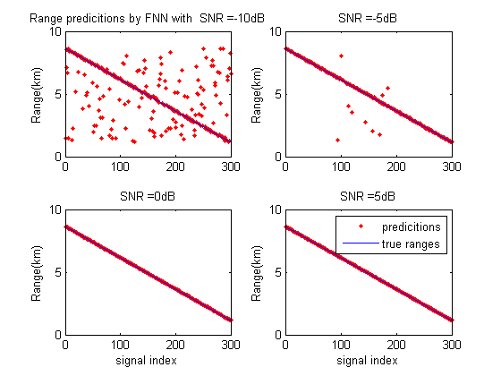
    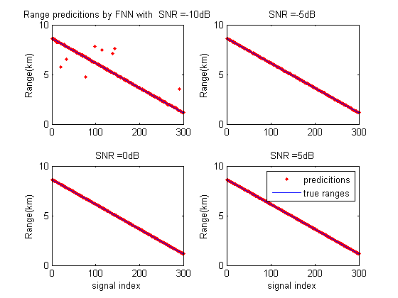

 图5 测试集声源Range预测(左：单频，右：组合频率)  

                                                表1： 仿真数据不同信噪比下模型准确度

                                SNR             | -10dB        | -5dB         | 0dB          | 5dB
                                -------------   | -------------| -------------| -------------| ----
                                @109Hz          | 18%          | 48%          | 70%          |80%
                                @109,232,385Hz  | 35%          | 55%          | 80%          |90%

图5给出了不同信噪比(-10dB,-5dB,0dB,5dB)下，FNN在测试集上的预测和真实值的比较，可以看出随着信噪比的增加，FNN的分类准确度不断提高，并且相同信噪比下，多频的训练下模型效果好于单频模型。单频时，各信噪比下，测试集上的分类准确度为18%，48%，70%和80%；多频时则分别提高了17%，7%，10%，10%。

  
    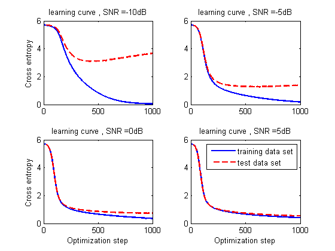
    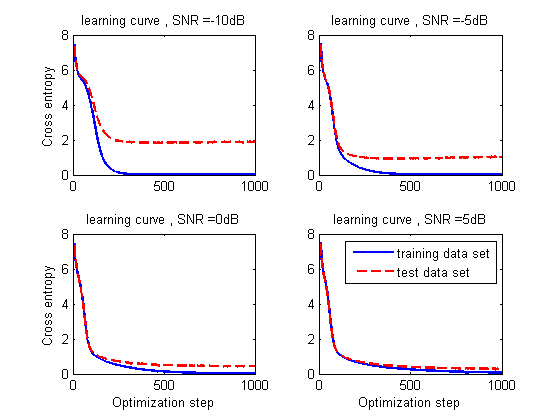

 图6 学习曲线：交叉熵随训练步数的变化(左：单频，右：多频)  

图6给出了模型训练过程中，交叉熵在训练集和测试集上收敛情况。基本上，对于不同的信噪比和频率情况，FNN都是收敛的；
低信噪比(<0dB)比较低时,FNN分类器在测试集上的表现差于在训练集上的表现，
出现[过拟合](https://en.wikipedia.org/wiki/Overfitting)，这是样本噪音干扰过大造成的，可以通过增大数据样本，以及[正则化](https://en.wikipedia.org/wiki/Regularization_(mathematics))的方法缓解。
高信噪比时，交叉熵学习曲线都收敛到了比较低的值；同时，多频时的表现要好于单频时的表现。

### 实验数据训练和测试的结果
实验数据取自[SWell96Ex Event S5](http://swellex96.ucsd.edu/s5.htm)，VLA是一个含有21元传感器的垂直阵，我们使用其接收数据来训练神经网络，如图7中路径所示，海试发射船从VLA的一侧沿直线驶向另一侧，船速是5节(2.5m/s)，垂直阵总共记录了75min的数据。仿真中，为了方便处理，我们取了0~50min的数据作为训练集。

  
    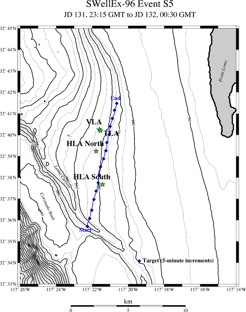

图7 试验示意图

*Note* : *垂直阵的位置并不在水面船的运动轨迹上，因此运动轨迹上的均匀采样并不是水面船到垂直阵Range上的均匀采样*

同仿真数据训练部分，我们把所时间段对应的水面船轨迹等分为300个网格，每个网络25m,共有3000s的接收数据，每网格有10s，按取1-s为一个快拍，每2个快拍求均值得到一个21*21的采样协方差矩阵处理，可以得到3000个样本作为神经网络的输入。在训练的时候，我们取了9/10的样本(2700)作为训练集，另外1/10(300)作为测试集。

在测试集上，FNN分类器达到了90%以上的准确度，说明，FNN确实学到了数据的特性。单频的时候，385Hz的表现最好，达到了99.7%，109Hz最差，为89.3%。组合频率的时候，分类器准确度为99%，好于单频的效果。

  
    
    
    
    

图8 测试集声源Range预测

## FNN定位的性能以及与传统匹配场处理方法的比较
为了考查FNN的定位效果，这里应用了Bartlett MFP对声源位置进行定位，来和FNN的结果进行比较。在Bartlet处理器中，使用了两种拷贝场。
第一种是用Kraken模型设置图4的环境参数数值计算出来的，
另一种是将测量数据作为拷贝场，匹配峰值输出如图9。
不同频率下，各种方法的定位准确度及绝对值误差归纳在表1，表2中。
可以看到，不管是单频还是组合频率，FNN的准确度都是好于传统方法的，
另外，FNN的效果不差于，多数时候好于直接用采样协方差矩阵(也就是训练数据)直接匹配的效果(图中给出的MCE)，说明FNN对于定位问题是有意义的。

  
    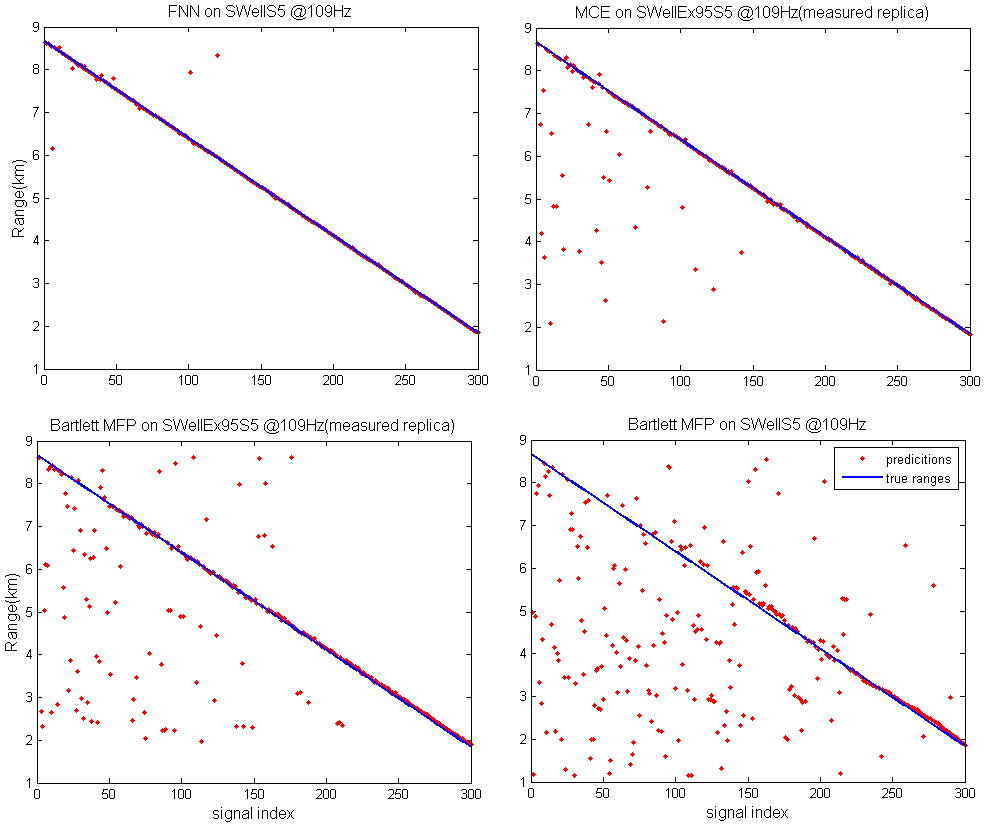
    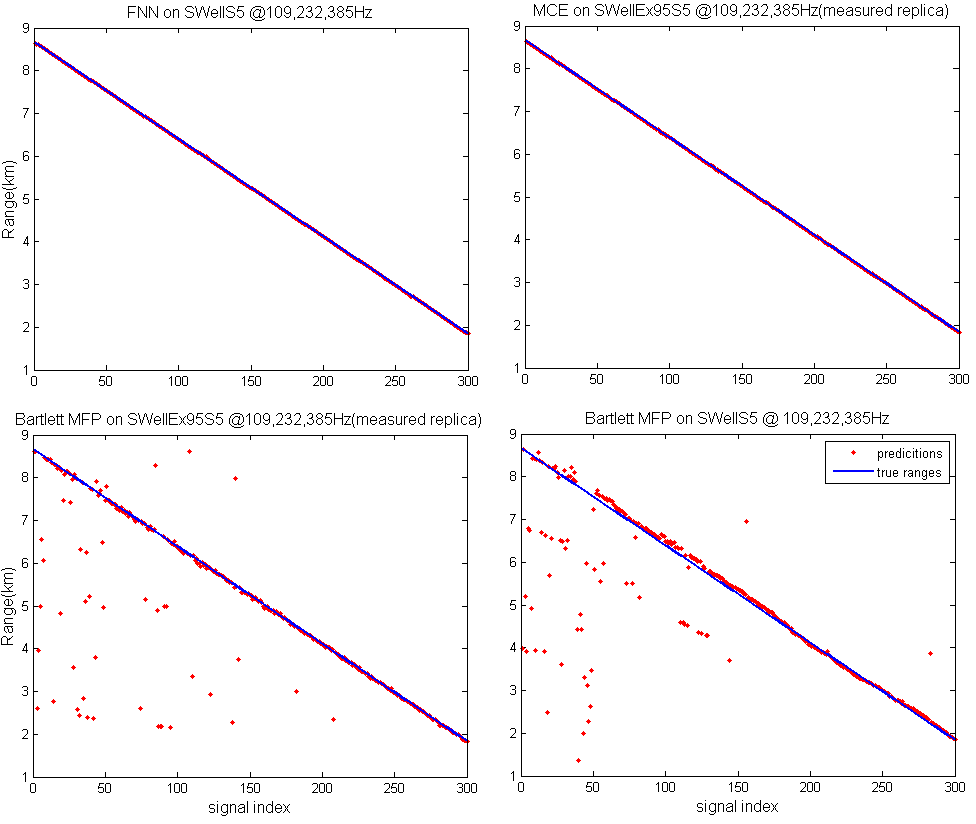

图9 FNN定位的性能以及与传统匹配场处理方法的比较
（左：单频@109Hz 右：组合频率@109，232，385Hz） 

                                        表2： SWell96Ex-S5试验数据下FNN与MFP定位准确度

                        Methods         | FNN          | MCE          | Bartlett 1   | Bartlett 2
                        -------------   | -------------| -------------| -------------| ----
                        @109Hz          | 89.3%        | 72.3%        | 37.7%        | 3.7%
                        @232Hz          | 97%          | 91%          | 17.7%        | 4.3%
                        @385Hz          | 99.7%        | 97.7%        | 14%          | 0.67%
                        @109,232,385Hz  | 99%          | 99.7%        | 40.7%        | 7.7%

注：表2中Bartlett 1的拷贝场用的是测量数据，
           Bartlett 2的拷贝场是Kraken模型计算出来的(表3同)                      

                                        表3： SWell96Ex-S5试验数据下FNN与MFP定位误差(m)

                        Methods         | FNN          | MCE          | Bartlett 1   | Bartlett 2
                        -------------   | -------------| -------------| -------------| ----
                        @109Hz          |   28.1       |  290.3       |  852.8       | 1219.5
                        @232Hz          |   7.4        |   2.5        |  832.3       |1360.1
                        @385Hz          |   0.08       |   0.58       |   1266.7     |1756.3
                        @109,232,385Hz  |   0.25       |   0.083      |   477.2      |722.9

### 声速剖面失配对定位结果的影响
在匹配场定位方法中，模型精度受失配影响很大。在这里，通过简单的改变声速剖面，给出了FNN在不同程度的声速剖面变化下的定位结果。图10，12，13的仿真中，快拍数Ns=10,信噪比SNR=5dB。

  
    
    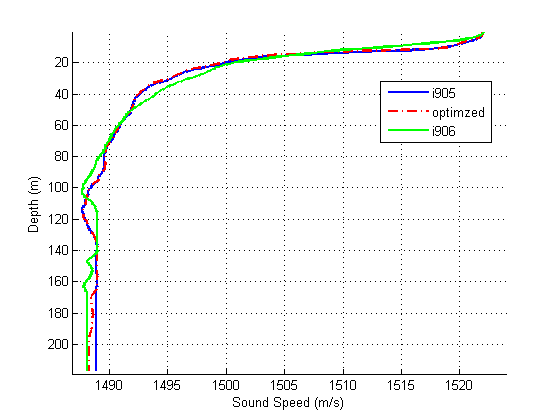

图10 SSP失配对FNN定位结果的影响

图中，Ns=10,SNR=5dB；(a),(d),(g):109,232,385Hz; (b),(e),(h):127,163,280Hz;(c),(f),(I):145,198,335Hz；(a),(b),(c):optimized;(d),(e),(f):i905;(g),(h),(i):i906。

标记为i905的ssp相对于用来训练网络的ssp-optimized只有很微小的变化，同一深度的下的声速差异在0.5m/s以内(160m深度以下除外)；
i906相对与optimized变化要大很多，从ssp的形状上就可以看出明显的差异。
从图10左图可以看出，FNN在ssp变化很小的时候，定位效果依然很好，准确度在85%以上，并且定位误差保持在一个网格以内；但是，当ssp变化很大的时候，定位效果变得很差，定位精度在50%以下，并且距离越近，定位误差越大。

图11，给出了1000次蒙特卡洛仿真绘制的FNN,Bartlett,MCE性能曲线。在声速剖面变化比较小的时候，FNN的定位效果最好，MCE次之，Bartlett最差。在声速剖面变化比较大时，同样地，定位准确度FNN最好，MCE次之，Bartlett最差，但是定位误差MCE要好于FNN，说明FNN在声速剖面失配比较大的情况下，依然能保持好于其他方法的定位准确度，但野值点变多。

  
    
    
    
    

图11
FNN定位的性能曲线（组合频率@109，232，385Hz） 

### 混合不同ssp下采集数据进行训练的结果
为了改善声速失配对FNN定位效果的影响，可以混合几个差异比较大的ssp下的采集数据对神经网络进行训练，仿真结果表明，混合数据训练能明显提高分类器的泛化能力。

  
    
    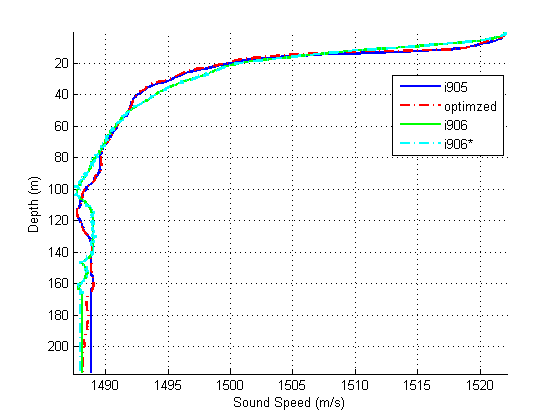

图12 混合不同ssp(optimized+i906)下仿真数据进行训练的结果

图中，Ns=10,SNR=5dB；(a),(d),(g) :109,232,385Hz; (b),(e),(h):127,163,280Hz;(c),(f),(I):145,198,335Hz;(a),(b),(c) :optimized+i906; (d),(e),(f):i905;(g),(h),(i):i906i*。

图12右中的i906\*是在ssp-i906的基础上，加上了一点高斯噪声，作为仿真中的测试数据。从图12左图可以看出，在混合数据训练下，FNN分类器在i905,i906\*两个差异很大的ssp上都有很好的定位效果。

  
    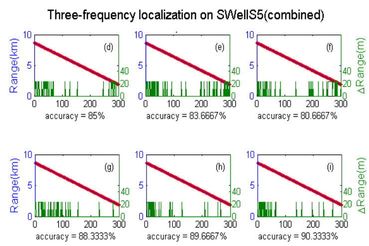
    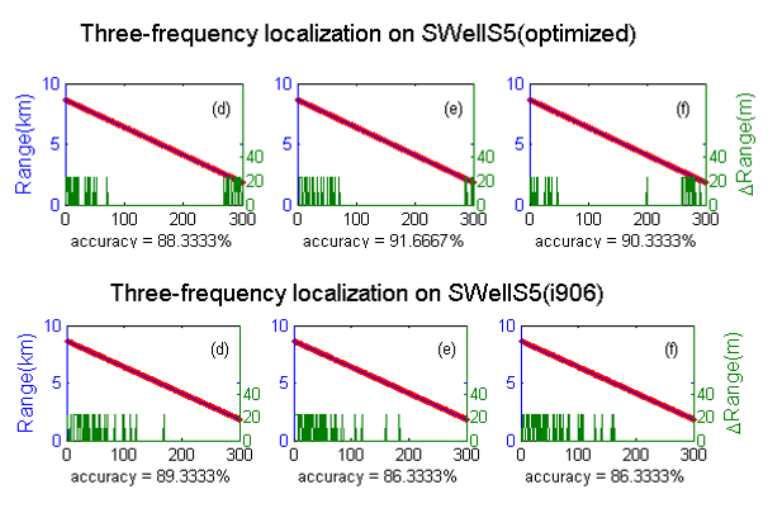

图13 混合数据训练和单一数据训练比较

图中，Ns=10,SNR=5dB；Up to down:i905,i906*。

虽然相比于单一数据训练的时候，混合训练FNN在i905上的定位效果稍稍下降，但是在i906\*上效果却得到了提高，这是个有趣的现象，值得深入。

1000次蒙特卡洛仿真绘制的性能曲线：

  
    
    

图14
FNN定位的性能曲线（组合频率@109，232，385Hz） 

## 三、小结
#### 1. 结论和文献比较
- 在[Niu and Gerstoft JASA, 2016](https://arxiv.org/abs/1701.08431)的工作中，作者提出可以将海洋波导中声源定位问题看作机器学习框架下的分类问题，并在Noise09实验数据上进行了验证，并有以下结论或结果：
    - FNN分类器高信噪比时的预测效果好于低信噪比，并且低信噪比数据训练的模型容易出现过拟合；
    - 组合频率时的效果好于单一频率时的定位效果；
    - 训练的分类器在间隔一段时间(同一艘船，同一航线)采集的数据上能够有比较好的定位准确度；
    - 作者给出了一个例子，指出FNN分类器在Bartlett定位效果不好的时候，能够给出相对比较好的定位；
    - 给出了在Noise09实验数据集上，FNN和Bartlett定位效果的比较；
    - 此外，作者还简单讨论了隐含层神经元个数对定位结果的影响，还将FNN的分类效果与SVM,RF方法进行了比较。
- 这篇报告，在SWell96实验数据上，重现了Niu的工作，以上结论一致。
#### 2. 我做的工作
考虑到上述结论的第3，4点比较模糊，以及第5点仅是在特定数据集上的结果，
这篇报告中增加了以下内容

- 声速剖面失配对FNN分类器的影响：声速剖面变化比较小的时候，分类器效果基本保持不变；在声速剖面变化比较大的时候，分类器性能显著下降，但依然好于Bartlett;
- 增加了与MCE的对比：
     - FNN性能可能不是总是好于数据的直接匹配，可能存在一个信噪比阈值；
     - 在声速剖面失配比较大的时候，FNN的的准确度虽然好于MCE，但野值点变多；
- 一个有趣的发现：混合训练能明显提高分类器的泛化能力，分类器性能可能好于单一数据训练。

#### 3. 计划
- 继续混合数据训练
- 加深网络的深度并正则化或者卷积神经网络，并解释FNN学习到的权重
- 尝试深度维定位问题的网络训练