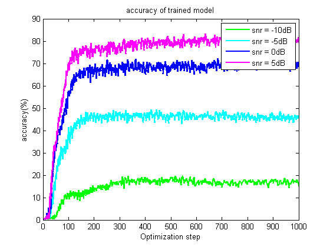
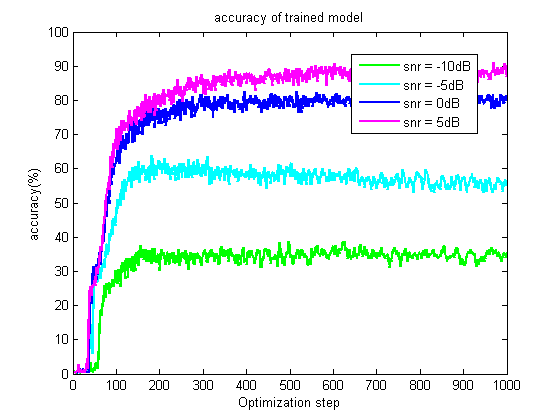

# 基于有监督机器学习的声源定位
## 一 、基于机器学习的定位方法
### 输入数据预处理：
>输入采样协方差矩阵

- 声压：

	其中，**_n_**是噪声，**_S(f)_**是声源信号， 
    **_g(f,r)_**是格林函数，接收阵有**_L_**个传感器

- 归一化：
    
    复声压归一化，取**Ns**个快拍的均值得采样协方差矩阵

- 采样协方差矩阵：

	最后，取采样协方差矩阵上三角每个元素的实部和虚部，组成 **_D=L*(L+1)_**维的列向量作为前馈神经网络的输入。

###声源位置映射：
>声源定位当作分类问题

将要搜索的Range划分成K个网格，一个声源水平位置对应一个标记向量**t n**，每一个向量只有一个元素是1，对应声源位置

    

其中，n=1,...,N是输入样本的序号,rk(k=1,...,K)是预先标记的水平位置，因此每一个输入样本的标记向量tn都对应一个水平位置rk。

    

 图1 声源定位当作分类问题 

###前馈神经网络:
>网络由输入、输出和一个隐含层构成，分别包含D，M，K个神经元

>神经网络的输出对应了声源水平位置的概率估计

 

  

 图 2 前馈神经网络 

_**W**_ , **_V_** 是待学习的神经网络系数，**_f_**, **_h_**为非线性函数，

 

  

 图 3 **_Sigmoid&Softmax_**函数 

神经网络训练的目标函数为：

 

  

##二、仿真和实验结果
>Matlab处理数据+Tensorflow训练神经网络

仿真环境为[SWell96Ex](http://swellex96.ucsd.edu/environment.htm),如下图：

    

 图4 仿真环境示意图 

###仿真设置
用来训练神经网络的声学数据由Kraken生成,仿真中Ns=10，L=21，D=441，M=441，K=300。训练集是1.82-8.65km之间的均匀采样的3000个数据样本，测试集为另外生成的300个数据样本，仿真中噪声设置为高斯白噪声。
####仿真数据训练和测试的结果
单频频率为109Hz，多频频率为109,232,385Hz

   
    
    

 图5 测试集声源Range预测(左：单频，右：多频)  

  
    
    

 图6 模型准确度与信噪比，训练步数的变化关系
(左：单频，右：多频)  

  
    
    

 图7 学习曲线：交叉熵随训练步数的变化(左：单频，右：多频)  

###实验数据训练和测试的结果
实验数据取自[SWell96Ex Event S5](http://swellex96.ucsd.edu/s5.htm)，数据处理的时候，取1s为一个快拍（无重叠）,每2个快拍求一次采样协方差矩阵，也即取Ns=2，其余参数同仿真数据训练部分。同样，图8~9中，单频频率为109Hz，多频频率为109,232,385Hz。

  
    
    

图8 测试集声源Range预测(左：单频，右：多频)  

  
    
    

图9 学习曲线：交叉熵随训练步数的变化(左：单频，右：多频)  

  
    

图10 模型准确度随训练步数的变化 

##FNN定位的性能以及与传统匹配场处理方法的比较

  
    
    
    
    

图11 FNN定位的性能以及与传统匹配场处理方法的比较（单频@109Hz） 

Note:

  
    
    
    
    

图12
FNN定位的性能以及与传统匹配场处理方法的比较（多频点@109，232，385Hz） 

Note:

###声速剖面失配对定位结果的影响
图13，15，16的仿真中，快拍数Ns=10,信噪比SNR=5dB。

  
    
    

图13 SSP失配对FNN定位结果的影响

图中，Ns=10,SNR=5dB；(a),(d),(g):109,232,385Hz; (b),(e),(h):127,163,280Hz;(c),(f),(I):145,198,335Hz；(a),(b),(c):optimized;(d),(e),(f):i905;(g),(h),(i):i906。

1000次蒙特卡洛仿真绘制性能曲线：

  
    
    
    
    

图14
FNN定位的性能曲线（多频点@109，232，385Hz） 

###混合不同ssp下采集数据进行训练的结果

  
    
    

图15 混合不同ssp(optimized+i906)下仿真数据进行训练的结果

图中，Ns=10,SNR=5dB；(a),(d),(g) :109,232,385Hz; (b),(e),(h):127,163,280Hz;(c),(f),(I):145,198,335Hz;(a),(b),(c) :optimized+; (d),(e),(f):i905;(g),(h),(I):i906i*。

  
    
    

图16 混合数据训练和单一数据训练比较

图中，Ns=10,SNR=5dB；Up to down:i905,i906*。

1000次蒙特卡洛仿真绘制性能曲线：

  
    
    

图17
FNN定位的性能曲线（多频点@109，232，385Hz） 

##三、小结
